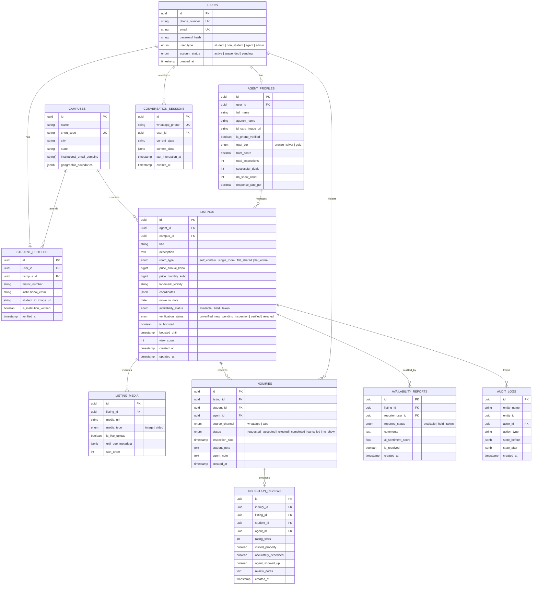
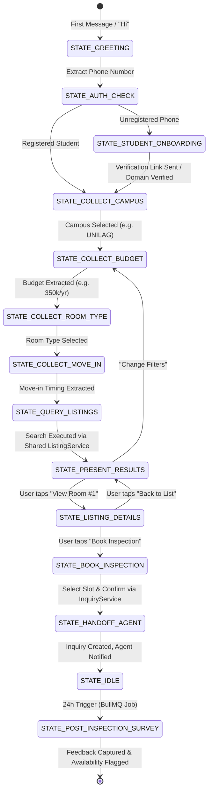
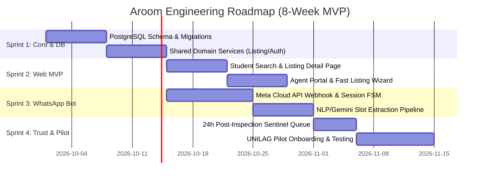

# Aroom: Comprehensive Technical Implementation Plan
**Campus Accommodation Platform with WhatsApp AI Triage**  
*Document Version: 1.0 — Architecture & Engineering Specification*  
*Based on: `Aroombrief.md` (Prepared for Mfoniso Akpatang)*

---

## 1. Executive Summary & Architectural Tenet

The primary existential threat to student housing marketplaces in Nigeria is **lack of trust** (phantom listings, double-booking, disappeared inspection fees, and unvetted agents), not lack of software features. 

The core architectural invariant of **Aroom** is:
1. **Decoupled Visibility vs. Verification**: Listings go live immediately as `Unverified - New` so agents face zero onboarding friction, while background verification upgrades listings to `Verified` via student spot-checks and proof of physical presence.
2. **Unified Core Domain Service**: The WhatsApp AI Bot and the Web Application are purely **presentation interfaces** over a single, shared domain service layer (`ListingService`, `InquiryService`, `TrustService`). No business rules or booking state logic are ever duplicated across channels.
3. **Deterministic FSM with Structured AI Extraction**: The WhatsApp bot is an auditable **Finite State Machine (FSM)**. AI (LLM) is strictly confined to intent and slot extraction (parsing natural language campus, budget, room type, move-in date) into a validated schema. The LLM never hallucinates inventory or touches the database directly.
4. **Time-Waster Shield for Agents**: Agents only receive inquiries from pre-verified students (institutional email domain check or validated student identity).
5. **Physical Inspection Over Digital Escrow (MVP)**: In-app payments are deliberately deferred at MVP. All inspections occur offline, eliminating payment scam vectors while focusing on lead qualification and verification.

---

```
                                    +-----------------------------------------+
                                    |              CLIENT LAYERS              |
                                    +-----------------------------------------+
                                    |  Student Web App  |  Agent Web Portal   |
                                    |    (Next.js 15)   |     (Next.js 15)    |
                                    +---------+-------------------+-----------+
                                              |                   |
WhatsApp User (Student)                       |                   |
       |                                      |                   |
       v                                      v                   v
+--------------+   Webhook Event     +----------------------------------------+
| Meta / Twilio|<------------------->|             FASTIFY / NESTJS           |
| Cloud API    |                     |            BACKEND REST API            |
+--------------+                     +-------------------+--------------------+
                                                         |
                                 +-----------------------+-----------------------+
                                 |                                               |
                                 v                                               v
                 +-------------------------------+               +-------------------------------+
                 |  WHATSAPP ADAPTER & FSM       |               |    SHARED DOMAIN SERVICES     |
                 |  - Session Manager            |               |  - ListingService             |
                 |  - Extraction Pipeline        |-------------->|  - InquiryService             |
                 |    (Regex + Gemini Flash)     |               |  - Trust & VerificationService|
                 +-------------------------------+               |  - IdentityService            |
                                                                 +---------------+---------------+
                                                                                 |
                                                                 +---------------+---------------+
                                                                 |                               |
                                                                 v                               v
                                                 +-------------------------------+ +-----------------------------+
                                                 |      PostgreSQL Database      | |     Private Object Storage  |
                                                 |  - Properties, Agents, Users  | |       (Cloudflare R2 / S3)  |
                                                 |  - FSM State, Inquiries, Logs | |  - Listing Photos (Public)  |
                                                 +-------------------------------+ |  - Agent/Student IDs (Priv) |
                                                                 |                 +-----------------------------+
                                                                 v
                                                 +-------------------------------+
                                                 |      Async Task Queue         |
                                                 |    (Redis + BullMQ)           |
                                                 |  - Post-Inspection Feedback   |
                                                 |  - Availability Sentinel      |
                                                 +-------------------------------+
```

---

## 2. Pillar I: Database & API Design

### 2.1 Entity Relationship Diagram (ERD)



---

### 2.2 PostgreSQL Schema DDL (Production Grade)

```sql
-- Enable necessary extensions
CREATE EXTENSION IF NOT EXISTS "uuid-ossp";
CREATE EXTENSION IF NOT EXISTS "pgcrypto";

-- User Classification Enums
CREATE TYPE user_type_enum AS ENUM ('student', 'non_student', 'agent', 'admin');
CREATE TYPE account_status_enum AS ENUM ('active', 'suspended', 'pending_verification');
CREATE TYPE room_type_enum AS ENUM ('self_contain', 'single_room', 'flat_shared', 'flat_entire');
CREATE TYPE availability_status_enum AS ENUM ('available', 'held', 'taken');
CREATE TYPE verification_status_enum AS ENUM ('unverified_new', 'pending_inspection', 'verified', 'rejected');
CREATE TYPE trust_tier_enum AS ENUM ('bronze', 'silver', 'gold');
CREATE TYPE inquiry_status_enum AS ENUM ('requested', 'accepted', 'rejected', 'completed', 'cancelled', 'no_show');
CREATE TYPE source_channel_enum AS ENUM ('whatsapp', 'web');

-- 1. Campuses
CREATE TABLE campuses (
    id UUID PRIMARY KEY DEFAULT uuid_generate_v4(),
    name VARCHAR(255) NOT NULL,
    short_code VARCHAR(50) UNIQUE NOT NULL, -- e.g. 'UNILAG', 'UNIBEN'
    city VARCHAR(100) NOT NULL,
    state VARCHAR(100) NOT NULL,
    institutional_email_domains TEXT[] NOT NULL DEFAULT '{}', -- e.g. ['@live.unilag.edu.ng']
    geographic_boundaries JSONB,
    created_at TIMESTAMPTZ NOT NULL DEFAULT NOW()
);

-- 2. Users Table
CREATE TABLE users (
    id UUID PRIMARY KEY DEFAULT uuid_generate_v4(),
    phone_number VARCHAR(30) UNIQUE NOT NULL,
    email VARCHAR(255) UNIQUE,
    password_hash VARCHAR(255),
    user_type user_type_enum NOT NULL DEFAULT 'student',
    account_status account_status_enum NOT NULL DEFAULT 'active',
    created_at TIMESTAMPTZ NOT NULL DEFAULT NOW(),
    updated_at TIMESTAMPTZ NOT NULL DEFAULT NOW()
);

-- 3. Student Profiles
CREATE TABLE student_profiles (
    id UUID PRIMARY KEY DEFAULT uuid_generate_v4(),
    user_id UUID NOT NULL REFERENCES users(id) ON DELETE CASCADE,
    campus_id UUID NOT NULL REFERENCES campuses(id),
    matric_number VARCHAR(100),
    institutional_email VARCHAR(255),
    student_id_image_url VARCHAR(512),
    is_institution_verified BOOLEAN NOT NULL DEFAULT FALSE,
    verified_at TIMESTAMPTZ,
    CONSTRAINT unique_user_student UNIQUE(user_id)
);

-- 4. Agent Profiles
CREATE TABLE agent_profiles (
    id UUID PRIMARY KEY DEFAULT uuid_generate_v4(),
    user_id UUID NOT NULL REFERENCES users(id) ON DELETE CASCADE,
    full_name VARCHAR(255) NOT NULL,
    agency_name VARCHAR(255),
    id_card_image_url VARCHAR(512) NOT NULL,
    is_phone_verified BOOLEAN NOT NULL DEFAULT FALSE,
    trust_tier trust_tier_enum NOT NULL DEFAULT 'bronze',
    trust_score NUMERIC(5, 2) NOT NULL DEFAULT 50.00, -- 0.00 to 100.00
    total_inspections INT NOT NULL DEFAULT 0,
    successful_deals INT NOT NULL DEFAULT 0,
    no_show_count INT NOT NULL DEFAULT 0,
    response_rate_pct NUMERIC(5, 2) NOT NULL DEFAULT 100.00,
    created_at TIMESTAMPTZ NOT NULL DEFAULT NOW(),
    CONSTRAINT unique_user_agent UNIQUE(user_id)
);

-- 5. Listings Table
CREATE TABLE listings (
    id UUID PRIMARY KEY DEFAULT uuid_generate_v4(),
    agent_id UUID NOT NULL REFERENCES agent_profiles(id) ON DELETE RESTRICT,
    campus_id UUID NOT NULL REFERENCES campuses(id) ON DELETE RESTRICT,
    title VARCHAR(255) NOT NULL,
    description TEXT NOT NULL,
    room_type room_type_enum NOT NULL,
    price_annual_kobo BIGINT NOT NULL, -- Stored in Kobo to avoid floating point issues (1 NGN = 100 Kobo)
    price_monthly_kobo BIGINT,
    landmark_vicinity VARCHAR(255) NOT NULL, -- e.g. "Akoka Gate, 5 mins walk"
    coordinates POINT,
    move_in_date DATE NOT NULL,
    availability_status availability_status_enum NOT NULL DEFAULT 'available',
    verification_status verification_status_enum NOT NULL DEFAULT 'unverified_new',
    is_boosted BOOLEAN NOT NULL DEFAULT FALSE,
    boosted_until TIMESTAMPTZ,
    view_count INT NOT NULL DEFAULT 0,
    created_at TIMESTAMPTZ NOT NULL DEFAULT NOW(),
    updated_at TIMESTAMPTZ NOT NULL DEFAULT NOW()
);

-- 6. Listing Media
CREATE TABLE listing_media (
    id UUID PRIMARY KEY DEFAULT uuid_generate_v4(),
    listing_id UUID NOT NULL REFERENCES listings(id) ON DELETE CASCADE,
    media_url VARCHAR(512) NOT NULL,
    media_type VARCHAR(20) NOT NULL DEFAULT 'image',
    is_live_upload BOOLEAN NOT NULL DEFAULT FALSE,
    exif_geo_metadata JSONB,
    sort_order INT NOT NULL DEFAULT 0
);

-- 7. Inquiries and Inspections
CREATE TABLE inquiries (
    id UUID PRIMARY KEY DEFAULT uuid_generate_v4(),
    listing_id UUID NOT NULL REFERENCES listings(id) ON DELETE RESTRICT,
    student_id UUID NOT NULL REFERENCES users(id) ON DELETE RESTRICT,
    agent_id UUID NOT NULL REFERENCES agent_profiles(id) ON DELETE RESTRICT,
    source_channel source_channel_enum NOT NULL DEFAULT 'whatsapp',
    status inquiry_status_enum NOT NULL DEFAULT 'requested',
    inspection_slot TIMESTAMPTZ,
    student_note TEXT,
    agent_note TEXT,
    created_at TIMESTAMPTZ NOT NULL DEFAULT NOW(),
    updated_at TIMESTAMPTZ NOT NULL DEFAULT NOW()
);

-- 8. Availability Reports (Crowdsourced Truth Engine)
CREATE TABLE availability_reports (
    id UUID PRIMARY KEY DEFAULT uuid_generate_v4(),
    listing_id UUID NOT NULL REFERENCES listings(id) ON DELETE CASCADE,
    reporter_user_id UUID NOT NULL REFERENCES users(id) ON DELETE RESTRICT,
    reported_status availability_status_enum NOT NULL,
    comments TEXT,
    ai_sentiment_score FLOAT, -- calculated from student feedback
    is_resolved BOOLEAN NOT NULL DEFAULT FALSE,
    created_at TIMESTAMPTZ NOT NULL DEFAULT NOW()
);

-- 9. Post-Contact Reviews & Ratings
CREATE TABLE inspection_reviews (
    id UUID PRIMARY KEY DEFAULT uuid_generate_v4(),
    inquiry_id UUID NOT NULL REFERENCES inquiries(id) ON DELETE CASCADE,
    listing_id UUID NOT NULL REFERENCES listings(id) ON DELETE CASCADE,
    student_id UUID NOT NULL REFERENCES users(id) ON DELETE RESTRICT,
    agent_id UUID NOT NULL REFERENCES agent_profiles(id) ON DELETE RESTRICT,
    rating_stars INT CHECK (rating_stars >= 1 AND rating_stars <= 5),
    visited_property BOOLEAN NOT NULL,
    accurately_described BOOLEAN NOT NULL,
    agent_showed_up BOOLEAN NOT NULL,
    review_notes TEXT,
    created_at TIMESTAMPTZ NOT NULL DEFAULT NOW(),
    CONSTRAINT unique_inquiry_review UNIQUE(inquiry_id)
);

-- 10. WhatsApp Conversation Session State
CREATE TABLE conversation_sessions (
    id UUID PRIMARY KEY DEFAULT uuid_generate_v4(),
    whatsapp_phone VARCHAR(30) UNIQUE NOT NULL,
    user_id UUID REFERENCES users(id) ON DELETE SET NULL,
    current_state VARCHAR(64) NOT NULL DEFAULT 'START',
    context_slots JSONB NOT NULL DEFAULT '{}'::jsonb,
    last_interaction_at TIMESTAMPTZ NOT NULL DEFAULT NOW(),
    expires_at TIMESTAMPTZ NOT NULL
);

-- 11. Security & State Audit Logs
CREATE TABLE audit_logs (
    id UUID PRIMARY KEY DEFAULT uuid_generate_v4(),
    entity_name VARCHAR(100) NOT NULL,
    entity_id UUID NOT NULL,
    actor_id UUID,
    action_type VARCHAR(100) NOT NULL,
    state_before JSONB,
    state_after JSONB,
    created_at TIMESTAMPTZ NOT NULL DEFAULT NOW()
);

-- HIGH PERFORMANCE SEARCH INDEXES
CREATE INDEX idx_listings_search_composite 
    ON listings(campus_id, availability_status, verification_status, room_type, price_annual_kobo);

CREATE INDEX idx_listings_availability 
    ON listings(availability_status) WHERE availability_status = 'available';

CREATE INDEX idx_inquiries_agent_status 
    ON inquiries(agent_id, status);

CREATE INDEX idx_conversation_phone_active 
    ON conversation_sessions(whatsapp_phone, expires_at);
```

---

### 2.3 Shared Domain Services (Core Service Layer)

To strictly adhere to the brief's requirement that **both the WhatsApp bot and web dashboard query the exact same logic**, we specify the TypeScript domain service interfaces:

```typescript
// src/domain/services/listing.service.ts

export interface SearchListingFilters {
  campusId: string;
  maxBudgetKobo?: number;
  minBudgetKobo?: number;
  roomType?: 'self_contain' | 'single_room' | 'flat_shared' | 'flat_entire';
  moveInBefore?: Date;
  onlyVerified?: boolean;
  limit?: number;
  offset?: number;
}

export interface ListingSearchResult {
  items: Array<{
    id: string;
    title: string;
    roomType: string;
    priceAnnualNaira: number;
    landmark: string;
    verificationStatus: 'unverified_new' | 'pending_inspection' | 'verified';
    availabilityStatus: 'available' | 'held' | 'taken';
    isBoosted: boolean;
    primaryPhotoUrl: string;
    agent: {
      name: string;
      trustTier: string;
      responseRate: number;
    };
  }>;
  total: number;
}

export interface IListingService {
  search(filters: SearchListingFilters): Promise<ListingSearchResult>;
  getById(id: string): Promise<ListingDetailDto>;
  createListing(agentId: string, input: CreateListingDto): Promise<ListingDto>;
  updateAvailability(listingId: string, actorId: string, status: 'available' | 'held' | 'taken', reason?: string): Promise<void>;
  requestSpotCheckVerification(listingId: string, evidence?: LiveUploadDto): Promise<void>;
}
```

```typescript
// src/domain/services/inquiry.service.ts

export interface CreateInquiryInput {
  listingId: string;
  studentUserId: string;
  sourceChannel: 'whatsapp' | 'web';
  requestedSlot?: Date;
  notes?: string;
}

export interface IInquiryService {
  createInquiry(input: CreateInquiryInput): Promise<InquiryDto>;
  confirmInspectionSlot(inquiryId: string, agentId: string, slot: Date): Promise<void>;
  recordInspectionOutcome(inquiryId: string, outcome: 'completed' | 'no_show' | 'cancelled'): Promise<void>;
  submitInspectionFeedback(input: SubmitFeedbackDto): Promise<void>;
}
```

```typescript
// src/domain/services/trust.service.ts

export interface ITrustService {
  calculateAgentTrustScore(agentId: string): Promise<number>;
  processCrowdsourcedReport(report: CrowdsourcedReportDto): Promise<void>;
  flagListingByAiSentiment(listingId: string, sentimentText: string): Promise<void>;
}
```

---

### 2.4 REST API Specifications

All endpoints return uniform response shapes:
```json
{
  "success": true,
  "data": { ... },
  "error": null,
  "timestamp": "2026-09-26T12:00:00Z"
}
```

#### Authentication & Verification
* `POST /api/v1/auth/agent/signup` — Phone, Name, ID Document upload (Multipart). Triggers SMS OTP.
* `POST /api/v1/auth/agent/verify-otp` — Completes agent onboarding.
* `POST /api/v1/auth/student/signup` — Accepts `.edu.ng` email or standard email + Matric/Student ID upload.
* `POST /api/v1/auth/student/verify-email` — Token-based activation.

#### Listings
* `GET /api/v1/listings/search` — Search listings with query params (`campus_id`, `budget`, `room_type`, `verified_only`, `page`).
* `GET /api/v1/listings/:id` — Detailed view with agent reliability metrics and trust badge details.
* `POST /api/v1/listings` — (Agent Authenticated) Immediate publication with `unverified_new` tag.
* `PATCH /api/v1/listings/:id/status` — Fast toggle (`available`, `held`, `taken`).
* `POST /api/v1/listings/:id/live-upload` — Upload live camera shot with GPS EXIF data for rapid badge upgrade.

#### Inquiries & Inspection
* `POST /api/v1/inquiries` — Create inspection/contact lead (Unified endpoint called by Web & WhatsApp).
* `GET /api/v1/inquiries/agent-queue` — Agent view of qualified incoming leads.
* `PATCH /api/v1/inquiries/:id/schedule` — Agree on inspection appointment.
* `POST /api/v1/inquiries/:id/feedback` — Post-inspection rating and "Was it taken?" survey.

#### Webhooks
* `GET /api/v1/webhooks/whatsapp` — Meta Webhook challenge verification.
* `POST /api/v1/webhooks/whatsapp` — Inbound message intake with HMAC SHA-256 signature validation and deduplication.

---

## 3. Pillar II: WhatsApp Bot Development

### 3.1 WhatsApp Bot Architecture & Flow

The bot runs on a **Deterministic Finite State Machine (FSM)**. The user conversation state is loaded from PostgreSQL (`conversation_sessions`) on every incoming webhook event.



---

### 3.2 Hybrid NLP/LLM Intent & Slot Extraction Pipeline

Rather than passing raw chat turns to an open LLM prompt (which introduces hallucination, latency, and high cost), the bot uses a **two-tier parsing pipeline**:

1. **Tier 1: Fast Deterministic Tokenizer (0ms, 100% Precision)**
   - Regex patterns for Nigerian student rent formats:
     - `/(?:₦|N|NGN)?\s*(\d{2,4})\s*(?:k|thousand)/i` -> converts `350k` to `350,000 NGN` (`35,000,000 Kobo`).
     - Key terms: `"selfcon"`, `"self-contain"`, `"single room"`, `"shared flat"`.
     - Campus codes: `"unilag"`, `"uniben"`, `"futa"`, `"oau"`.
2. **Tier 2: Structured LLM Slot Filler (Fallback)**
   - If deterministic parsing has missing slots, invoke **Gemini 1.5 Flash** with strict `responseSchema` (JSON schema mode).
   - System Prompt:
     ```
     You are the Aroom Student Housing Intake Agent. Extract the following slots from the user's message:
     - campus: (string or null)
     - max_budget_naira: (integer or null)
     - room_type: ('self_contain' | 'single_room' | 'flat_shared' | 'flat_entire' | null)
     - move_in_timeframe: ('immediate' | 'next_month' | 'next_semester' | null)
     Return ONLY JSON adhering to the schema. Do not answer questions outside housing triage.
     ```

### 3.3 WhatsApp Interactive UI Templates

The bot strictly uses **Meta WhatsApp Interactive Messages** (List Messages and Reply Buttons) for high conversion and zero user typing errors:

* **Interactive List Message (Campus Selection)**:
  - Header: *"Choose your university"*
  - Body: *"We only surface verified off-campus accommodation within walking distance of your campus."*
  - Rows: `[UNILAG - University of Lagos]`, `[UNIBEN - University of Benin]`, `[FUTA - Akure]`.
* **Interactive Reply Buttons (Room Type)**:
  - Buttons: `[Self Contain]`, `[Single Room]`, `[Shared Flat]`.
* **Product Carousel Cards (2–3 Top Listings)**:
  - Header Image: Listing primary verified photo.
  - Body: 
    ```
    🏠 Self-Contain in Akoka Gate (5 min walk)
    💰 ₦350,000 / year
    🛡️ Status: [VERIFIED - PHYSICAL SPOT-CHECK]
    ⭐ Agent: Femi O. (4.9★, 98% Response)
    ```
  - Action Buttons: `[Book Inspection]`, `[Next Option]`, `[Filter Again]`.

---

### 3.4 The 24-Hour Availability Sentinel (Post-Inspection Crowdsourcing)

Double-booking and ghost listings are eliminated by automatically closing the feedback loop:

1. When a student books an inspection slot for Tuesday 2:00 PM, a background job (`BullMQ`) is queued for Tuesday 5:00 PM (+3 hours).
2. The bot sends a lightweight interactive survey:
   ```
   "Hi Chidi, hope your inspection at Akoka went well!
   Did you visit the room today?"
   [Yes, I visited]  |  [Agent didn't show up]  |  [Rescheduled]
   ```
3. If the student answers `Yes, I visited`:
   ```
   "Great! Was the property accurately described, and is it still available or did you/someone else pay?"
   [Still Available]  |  [Already Taken / Paid]  |  [Not as described]
   ```
4. If marked `Already Taken / Paid`:
   - An `availability_report` is logged.
   - The listing availability status is automatically transitioned to `held` or flagged for immediate moderator review, preventing any other student from wasting transport fare!
   - The inspecting student earns a "Verified Reviewer" trust rep on the platform.

---

## 4. Pillar III: Web & Frontend Development

### 4.1 Modern Web Tech Stack

* **Framework**: **Next.js 15 (App Router)** with React Server Components (RSC) for lightning-fast First Contentful Paint (LCP < 1.2s on mobile networks).
* **Styling & UI**: **Tailwind CSS v4** + **shadcn/ui** (accessible, accessible keyboard navigation, Radix primitives).
* **State & Data Fetching**: TanStack React Query v5 for client cache, Server Actions for mutations, Nuqs for URL search state synchronization.
* **Image Delivery**: Cloudflare R2 / AWS S3 with Next.js Image Optimization and automatic AVIF/WebP transcoding.
* **Form Handling**: React Hook Form + Zod for runtime schema validation matching backend DTOs.

---

### 4.2 Information Architecture & Screen Breakdown

```
aroom-web/
├── app/
│   ├── (marketplace)/                 # Student-Facing Public Pages
│   │   ├── page.tsx                   # Homepage & Instant Campus Search
│   │   ├── search/                    # Search Grid with Filter Drawer
│   │   ├── listings/[id]/             # Listing Detail Page & Trust Ledger
│   │   └── verify-student/            # Quick Student Verification Flow
│   ├── (agent)/                       # Agent-Facing Portal
│   │   ├── portal/dashboard/          # Active Listings & Status Toggles
│   │   ├── portal/listings/new/       # Mobile-Optimized 3-Step Creation Wizard
│   │   ├── portal/inquiries/          # Lead Queue with Student Verification Badges
│   │   └── portal/onboarding/         # Phone OTP + ID Card Upload
│   └── (moderator)/                   # Internal Trust & Safety Console
│       ├── admin/verification-queue/  # Side-by-side Photo / Geolocation Auditing
│       └── admin/disputes/            # Student Availability Flag Resolution
```

---

### 4.3 Component & UX Design System

#### 1. The Trust-First Listing Card
The student listing card is deliberately designed around **trust signals**, not just glossy pictures:
* **Prominent Trust Badge (Header)**:
  - `Verified - Physical Inspection`: Green shield with checkmark + tooltip: *"Inspected in-person by student spot-check on Sept 24"*.
  - `Unverified - New`: Amber warning pill with tooltip: *"Recently listed. Free to contact, but remember never to pay upfront inspection fees!"*.
* **Availability Micro-Status**:
  - `Available Now` (Bright green dot).
  - `Inspection Underway / Held` (Amber dot).
  - `Taken` (Muted grey overlay with disabled booking button).
* **Agent Trust Factor**:
  - Avatar with badge: `"Femi K. (Licensed Agent) • 96% punctuality"`.
* **Campus Proximity Metric**:
  - `"🚶 7 mins walk from UNILAG Back Gate"`.

#### 2. Agent 3-Step Mobile Listing Wizard
Agents need to upload listings in under **90 seconds** directly from their smartphone at the property:
* **Step 1: Core Details**: Room Type (toggle buttons), Annual Price (formatted in ₦ Naira automatically), Campus landmark.
* **Step 2: Instant Photo Upload**: 
  - Direct camera capture trigger (`capture="environment"`).
  - Optional: **Live Camera Mode** that attaches browser GPS coordinates and timestamps to the photo. If the GPS matches the campus boundary, the listing is automatically fast-tracked to `Verified`.
* **Step 3: Immediate Live Feedback**:
  - Banner: *"Your room is now live as [Unverified - New]! Students can see it right now."*
  - CTA: *"Want the [Verified] badge to get 4x more calls? Click here to request a student spot-check."*

#### 3. Moderator Verification & Dispute Queue
A lean internal dashboard allowing an admin or student ambassador to:
* View new agent ID photos and verify their details against public records.
* Review flagged availability reports (e.g. 2 students reported a room in Yaba as `Taken`). With 1-click, moderator updates status to `Taken` and sends an automated WhatsApp notification to the agent.

---

## 5. End-to-End Implementation Roadmap & Sprints



### Detailed Sprint Breakdown

#### Sprint 1 (Weeks 1–2): Infrastructure, Schema & Shared Service Core
* Set up PostgreSQL database with extensions, enums, tables, and indices.
* Configure Cloudflare R2 bucket with signed upload URLs for listing photos and private bucket for agent IDs.
* Implement `IdentityService`, `ListingService`, and `InquiryService` using clean architecture.
* Build automated test suite covering listing availability state transitions and concurrency locking.

#### Sprint 2 (Weeks 3–4): Web Platform (Student & Agent Experiences)
* Implement Next.js 15 app with Tailwind and shadcn/ui.
* Build public search page with campus filtering, budget sliders, and responsive listing detail modals.
* Build the Agent Mobile Listing Creation Wizard (90-second listing flow).
* Implement agent authentication via phone OTP and student institutional email validation.

#### Sprint 3 (Weeks 5–6): WhatsApp AI Triage Engine
* Deploy WhatsApp webhook receiver with signature validation and deduplication cache (Redis).
* Implement the Finite State Machine (FSM) session manager with PostgreSQL fallback.
* Integrate hybrid extraction pipeline: Regex for common budget/room patterns + Gemini Flash structured outputs.
* Connect FSM actions to `ListingService.search()` and `InquiryService.createInquiry()`.
* Conduct end-to-end sandbox testing with WhatsApp interactive lists and button messages.

#### Sprint 4 (Weeks 7–8): Trust Automation, Moderation Console & Pilot Launch
* Implement the BullMQ job worker for the 24-Hour Post-Inspection Sentinel.
* Build the internal Moderator Queue for verifying agent IDs and reviewing availability conflicts.
* Seed pilot campus data (e.g., University of Lagos - Akoka, Yaba, Bariga borders).
* Onboard 15 selected verified agents and 100 pilot students for closed alpha testing.
* Monitor metric dashboards: time to verify, search-to-inspection rate, no-show rate.

---

## 6. Security, Compliance & Data Governance

1. **Identity & KYC Privacy**:
   - Agent government IDs and student matric cards are saved strictly in **private, non-public object storage**.
   - Presigned access URLs are restricted to 15-minute expirations and only accessible by authorized moderators.
2. **Zero In-App Escrow Liability**:
   - To eliminate regulatory friction with the Central Bank of Nigeria (CBN) and avoid chargeback/fake agent risks, all monetary transactions during the MVP phase remain strictly peer-to-peer after physical inspection.
3. **Webhook Idempotency & Rate Limiting**:
   - Meta WhatsApp webhooks can deliver duplicate events. An incoming message idempotency key (`message_id`) is cached in Redis for 10 minutes; duplicate message IDs are discarded immediately.
4. **Anti-Scraping & Agent Phone Masking**:
   - Phone numbers of agents are not displayed in raw HTML on search result cards to prevent scraping by rival portals. Direct contact is unlocked only after a registered user initiates an inquiry.

---

## 7. Next Steps & Immediate Action Items

1. **Confirm the Pilot University**: Recommend **UNILAG (University of Lagos)** due to dense off-campus clusters (Akoka, Abule Oja, Bariga, Onike).
2. **Setup WhatsApp Business API Account**: Register Meta Developer Business App and obtain a phone number for the Aroom Official Bot.
3. **Repository Initialization**: Initialize mono-repo (e.g. Turborepo) with `apps/web` (Next.js), `apps/api` (Fastify/Node.js or NestJS), and `packages/shared-domain` (shared types, validations, and DTOs).
