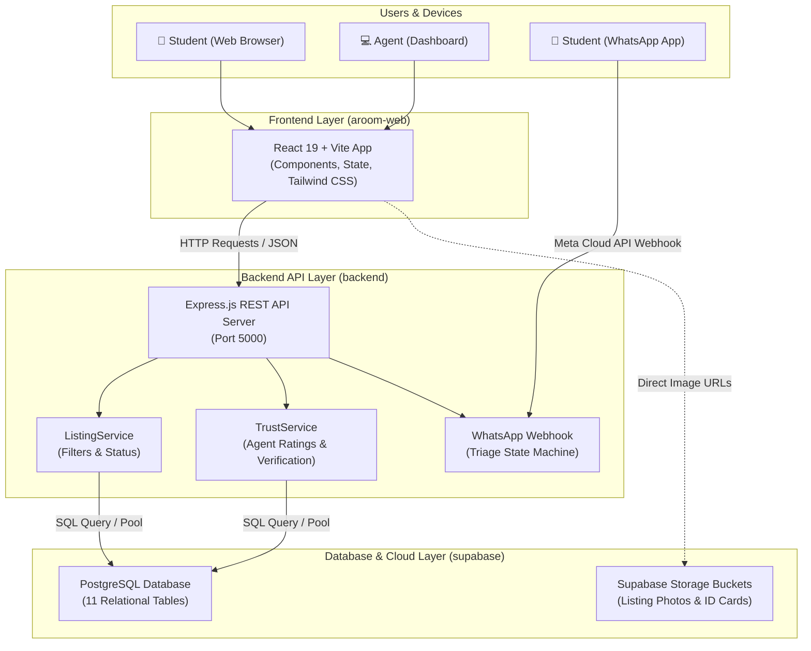

# 02 — Architecture & The Tech Stack

## 1. How Web Applications Work (The Client-Server Model)

When you open Google, Netflix, or Aroom in your browser, a continuous conversation is happening between your computer (the **Client**) and a computer in the cloud (the **Server**):

```
       [ Client (Browser) ]
         "Hey Server, show me verified rooms in Akoka under ₦400,000"
                  │
                  ▼   HTTP GET /api/v1/listings?maxPrice=400000
       [ Backend Server (Express) ]
         "Got it! Let me ask the database for those matching rooms."
                  │
                  ▼   SQL: SELECT * FROM listings WHERE price <= 40000000;
       [ Database (Supabase PostgreSQL) ]
         "Here are the 3 matching rows from our storage."
                  │
                  ▼   Returns Data (JSON)
       [ Client (Browser) ]
         Renders nice listing cards with photos and price tags on screen!
```

---

## 2. Aroom System Architecture Diagram



---

## 3. The Tech Stack Explained for Beginners

Why did we choose these technologies? Here is what each tool does in plain English:

### A. TypeScript (`.ts` and `.tsx` files)
- **What is it?** JavaScript with **types**.
- **Analogy:** Regular JavaScript is like writing an essay without spellcheck or grammar checks. You only find mistakes when your teacher grades it (when the app crashes in production). TypeScript checks your spelling **while you type**. If you declare that a listing's price is a number, TypeScript stops you if you accidentally try to treat it as text.

### B. React (`aroom-web/`)
- **What is it?** A frontend JavaScript library for building user interfaces using reusable building blocks called **Components**.
- **Analogy:** Think of LEGO bricks. Instead of building an entire webpage in one massive HTML file, you build a `<ListingCard />` brick, a `<TrustBadge />` brick, and a `<MoveInCostCalculator />` brick, then assemble them together.

### C. Vite
- **What is it?** A modern, ultra-fast frontend build tool and local development server.
- **Why use it?** When you save a file in `aroom-web`, Vite updates the browser in less than 50 milliseconds using Hot Module Replacement (HMR).

### D. Tailwind CSS
- **What is it?** A utility-first CSS framework for styling.
- **Why use it?** Instead of writing a separate `styles.css` file with hundreds of custom class names, you write styling utilities directly inside your HTML/JSX elements:
  ```html
  <button className="bg-green-600 hover:bg-green-700 text-white font-bold py-2 px-4 rounded">
  ```
  (`bg-green-600` = green background, `text-white` = white text, `rounded` = curved corners).

### E. Node.js & Express (`backend/`)
- **What is it?** 
  - **Node.js:** A JavaScript runtime that lets you run JavaScript on your computer/server, not just inside a web browser.
  - **Express:** A lightweight, fast framework for Node.js that makes it easy to create web APIs and listen for requests on ports (e.g. `http://localhost:5000/api/v1/listings`).

### F. PostgreSQL & Supabase (`supabase/`)
- **What is it?** 
  - **PostgreSQL:** One of the world's most reliable and powerful relational databases (SQL). It stores data in structured tables with strict columns, relationships, and data validation.
  - **Supabase:** An open-source cloud platform built on top of PostgreSQL that provides authentication, instant REST APIs, database hosting, and file storage for pictures.

---

### ⏭️ Next Step:
Proceed to **[03-database-and-supabase.md](./03-database-and-supabase.md)** to explore how our database tables, migrations, and security policies are constructed!

